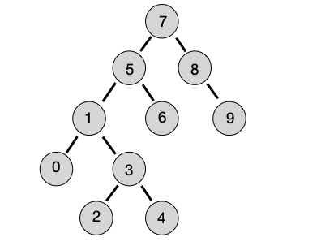

## Bu markdown dosyasında, Patika.dev platformunda eğitimini aldığım Veri Yapıları ve Algoritmalar dersi kapsamında yer alan 3 projeyi/ödevi anlatacağım.
---
# Proje 1
##  Birinci soru: [22,27,16,2,18,6] -> Insertion Sort

Yukarı verilen dizinin sort türüne göre aşamalarını yazınız.

Big-O gösterimini yazınız.

Time Complexity: Dizi sıralandıktan sonra 18 sayısı aşağıdaki case'lerden hangisinin kapsamına girer? Yazınız.
* Average case: Aradığımız sayının ortada olması
* Worst case: Aradığımız sayının sonda olması
* Best case: Aradığımız sayının dizinin en başında olması.

## İkinci soru: [7,3,5,8,2,9,4,15,6] dizisinin Selection Sort'a göre ilk 4 adımını yazınız.
---
# Proje 1 Çözümler:
## Birinci soru çözümler:
### Aşamaları:
I) [**22**,**27**,16,2,18,6] (İlk iki öğeye bakarız, sıralıdırlar.)

II) [22,**27**,**16**,2,18,6] (27 ve 16'ya bakarız, yerlerini değiştiririz.)

III) [**22**,**16**,27,2,18,6] (Bu sefer 22 ile 16'ya bakarız, yine yerlerini değiştiririz.)

IV) [16,22,**27**,**2**,18,6] (Şu ana kadar [16,22,27] sıralı bir dizi oluşturmuştur, bu sefer sıralanmamış kısımdan 2'yi alıp 27 ile karşılaştırırız. Yerlerini değiştiririz.)

V) [16,***22***,***2***,27,18,6] (Önceki adımlardaki gibi yer değiştirmesi gereken öğeleri kalın(bold) bir şekilde belirttim.)

VI) [**16**,**2**,22,27,18,6] (Bu işlem sonucunda [2,16,22,27] bizim sıralı dizimiz haline gelir)

VII) [2,16,22,**27**,**18**,6] (18'i alıp soluna bakmaya devam ederiz, yani 27 ile yer değişimi.)

VIII) [2,16,**22**,**18**,27,6] (18 ile 22 yer değişimi.)

IX) [2,16,18,22,**27**,**6**] (Halihazırda 6 dışında diğer tüm öğeler sıralıdır ve aslında bundan sonrası için benzer şekilde 6'yı sola doğru gelmesi gereken yere kadar solundaki her öğe ile karşılaştıra karşılaştıra yer değişimi yapacağız.)

X) [2,16,18,**22**,**6**,27] (22 ile 6 yer değiştirir.)

XI) [2,16,**18**,**6**,22,27] (18 ile 6 yer değiştirir.)

XII) [2,**16**,**6**,18,22,27] (16 ile 6 yer değiştirir.)

XIII) [2,6,16,18,22,27] (Sonunda her öğe olması gereken sıradadır.)
### Big-O Gösterimi:
O(n²)
### Average case : Aradığımız sayı 18 ve dizinin ortasında yer alır, bu da cevabı average case yapar.
---
## İkinci soru çözüm:
Dizinin başlangıç halinde önce dizinin tamamını bir gözden geçiririz ve en küçük elemanı bulup dizinin başına atarız, yani örneğimizdeki 2'yi alıp dizinin başındaki 7 ile yerini değiştiririz. Sonrasında yine dizinin sırası bozuk geride kalan kısmında en küçük elemanını buluruz ve o dizinin başına getiririz yani ikinci pozisyona ve bu böyle devam eder, ta ki hepsi sıralanmış oluncaya dek.

İlk hali: [**7**,3,5,8,**2**,9,4,15,6]

I) [2,**3**,5,8,7,9,4,15,6] (ilk öğe sırasında, sırasızlarda en küçük olan 3 de şansımıza yerindedir.)

II) [2,3,5,8,7,9,**4**,15,6] (ilk iki öğe sıralı, sırasızlarda 4 en küçük. 4 ile 5 yer değiştirir.)

III) [2,3,4,8,7,9,**5**,15,6] (ilk üç öğe sıralı, sırasızlarda 5 en küçük. 5 ile 8 yer değiştirir.)

IV) [2,3,4,5,7,9,8,15,**6**] (ilk dört öğe sıralı, sırasızlarda 6 en küçük. 6 ile 7 yer değiştirir. Bu aşamada dizinin son hali [2,3,4,5,6,9,8,15,7]'dir.)

---
# Proje 2
## [16,21,11,8,12,22] -> Merge Sort
* Yukarıdaki dizinin sort türüne göre aşamalarını yazınız.
* Big-O gösterimini yazınız.
---
## Proje 2 Çözümler:
## Aşamalar:
Diziyi parçalayıp tek öğeye düşürüp tek öğe halindeyken sıralama yapıp tekrar birleştiriyoruz basitçe.

I) Bir parça [16,21,11] diğer parça ise [8,12,22]

II) [16,21] ile [11] ve [8,12] ile [22] şeklinde daha da parçalanmış oldu.

III) [16] [21] [11] [8] [12] [22] Şimdi ise birleştirme zamanı! Hangisi küçükse başa yaz.

IV) [16,21] [8,11] [12,22] Sıraladık. Dikkat! 8, 11'in başına geldi.

V) [8,11,16,21] [12,22] İlk diziyle ilgili olarak: 16 mı 8 mi? 8 ilk sıraya gelir. 16 mı 11 mi? 11 ikinci sıra. 16 üç. 21 de dördüncü öğe olur.

VI) [8,11,16,21] [12,22]

VII) [8,11,12,16,21,22] Elerken şöyle sorarak ilerliyoruz: 8 mi 12 mi? 8. Zira birleştirilen dizilerin ilk elemanları zaten dizilerinin en küçükleri. Sonra  11 mi 12 mi? 11. 16 mı 12 mi? 12. 16 mı 22 mi? 16. 21 mi 22 mi? 21. En son sıraya da 22 gelir.
## Big-O:
O(n log n)

 Merge sort, hem ikiye bölerek arama(binary search - O (log n)) hem de doğrusal aramanın(linear search - O(n)) karışımı olan bir sıralama algoritmasıdır. Her işlemde O(n) time complexity'ye sahiptir. Bütüne bakınca da O(n log n)'dir. O(n²)'den daha hızlıdır. Merge sort ile diziyi daha küçük problemlere/dizilere ayırıp sıraladıktan sonra birleştirerek Insertion ya da Selection sorting gibi her defasında tüm diziyi tekrar taramaktan daha iyi bir performans elde etmiş oluruz.
 
 ---
 # Proje 3
 ## [7, 5, 1, 8, 3, 6, 0, 9, 4, 2] dizisinin Binary-Search-Tree aşamalarını yazınız.
Örnek: root x'dir. root'un sağından y bulunur. Solunda z bulunur vb.
# Proje 3 Çözüm:
Root 7'dir. Root'un sağında 8 yer alır. Solunda 5 bulunur. Bu şekilde devam ederiz küçükler sola, büyükler sağa şeklinde...

---
## Linkler
[Patika ödev detayları](https://app.patika.dev/courses/veri-yapilari-ve-algoritmalar/binary-search-tree-proje)

[Kodluyoruz](https://kodluyoruz.org/tr/kodluyoruz/)